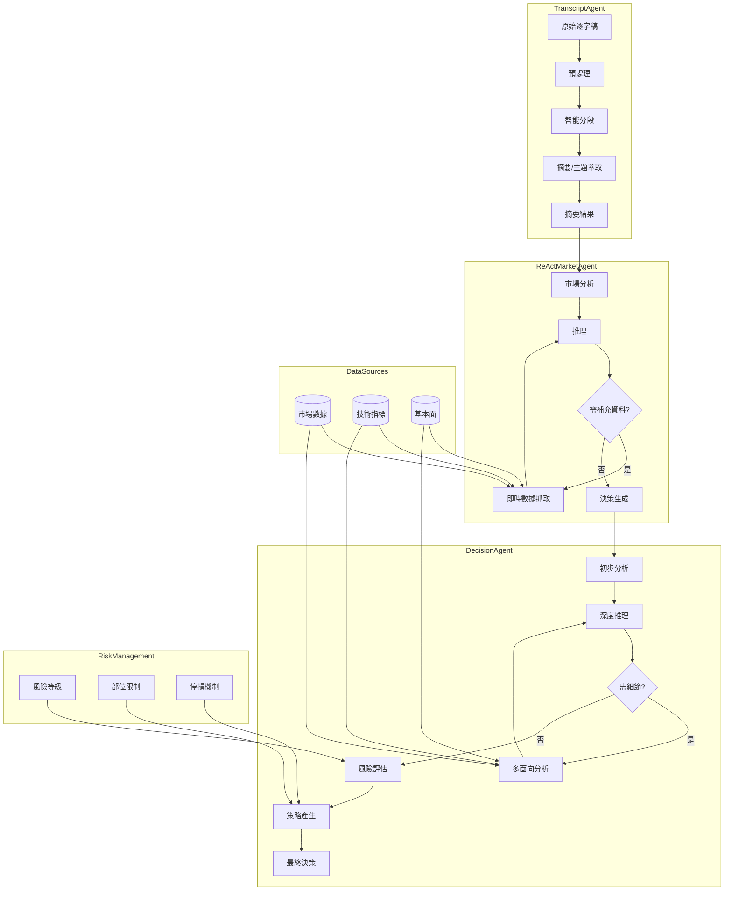

# Agents4Financial

一個結合 AI 智能代理的金融分析系統，專為自動化處理財經影音逐字稿、整合多元市場數據、產生投資洞見與風險評估而設計。

## 專案簡介

Agents4Financial 以模組化架構，串接 NLP、技術分析、基本面分析與風險管理，實現：
- 智能分段與摘要 YouTube 財經影片逐字稿
- 多維度市場情緒與趨勢分析
- 結合即時與歷史數據的投資決策生成
- 全面風險評估與部位建議
- 跨資料源整合，強化市場全貌理解

## 系統架構與流程

### 工作流程圖



## 主要模組

- **transcript_node.py**：逐字稿預處理、分段、摘要、主題與關鍵字萃取
- **market_node.py**：ReAct 架構市場分析、情緒判斷、技術指標計算、即時資料整合
- **decision_node.py**：標準/反思雙模式決策、風險評估、部位優化、信心分數
- **integrated_analyzer.py**：歷史權重分析、綜合報告產生、動態信心與風險管理

## 特色功能

- 🤖 先進 NLP：語意理解、摘要、主題萃取
- 📈 技術分析：即時多指標運算
- 📊 基本面分析：公司與總體經濟指標
- 🎯 風險管理：多層次風險評估與部位建議
- 📝 詳細報告：推理過程與信心分數
- 🔄 歷史分析：時間加權趨勢追蹤
- 🌐 全球視角：跨市場關聯分析

## 安裝需求

- Python 3.10 以上
- 主要套件（pip 安裝）：
  - langchain
  - langchain-ollama
  - opencc
  - pandas
  - yfinance
  - ta-lib
  - numpy
  - IPython

## 快速開始

1. 下載專案：
```bash
git clone https://github.com/yourusername/Agents4Financial.git
cd Agents4Financial
```

2. 安裝依賴：
```bash
pip install -r requirements.txt
```

3. 設定 Ollama 模型（於 Agentic_AI/constant.py）：
```python
model_name = "gemma3:27b"  # 或自訂模型
```

## 使用方式

### 標準分析
```python
from Agentic_AI.integrated_analyzer import IntegratedMarketAnalyzer
from Agentic_AI.decision_node import DecisionAgent

analyzer = IntegratedMarketAnalyzer()
decision_agent = DecisionAgent()

decision = decision_agent.generate_decision(stock_analysis, market_context)
report = decision_agent.generate_report(decision)
print(report)
```

### 歷史資料分析
```python
result = analyzer.analyze_with_history("2024/04/14")
```

## 輸出格式

- 市場情緒分析
- 交易訊號與建議
- 多因子風險評估
- 部位建議與技術/基本面指標
- 歷史趨勢與全球市場關聯

## 貢獻方式

1. Fork 本專案
2. 建立功能分支
3. 提交修改
4. 發送 Pull Request

## 授權

MIT License，詳見 LICENSE 檔案。
