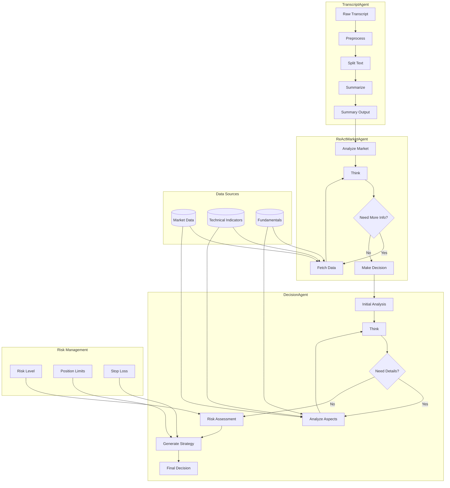

# Agents4Financial

A comprehensive financial analysis system that leverages AI agents to process daily financial video transcripts and generate investment insights.

## Project Overview

This project implements an advanced AI-driven financial analysis system that:
- Processes YouTube financial video transcripts with intelligent text segmentation
- Performs sentiment analysis with multi-dimensional market evaluation
- Generates data-driven investment decisions with comprehensive risk management
- Provides historical analysis with time-weighted insights
- Integrates multiple data sources for holistic market understanding

## System Architecture

### Workflow Diagram



### 1. Transcript Processing (transcript_node.py)
- Intelligent text preprocessing and noise reduction
- Dynamic text segmentation with overlap handling
- Advanced summarization with context preservation
- Keyword and theme extraction for market insights
- Language model-based semantic analysis

### 2. Market Analysis (market_node.py)
- ReAct (Reasoning + Action) architecture for dynamic analysis
- Multi-stage market evaluation pipeline:
  - Content Analysis → Sentiment Assessment → Market Context
- Real-time data integration with yfinance
- Advanced technical indicator calculations with ta-lib
- Global market correlation analysis

### 3. Decision Making (decision_node.py)
- Dual-mode decision generation:
  - Standard mode for direct analysis
  - Reflection mode for deep multi-cycle thinking
- Comprehensive risk assessment system:
  - Market risk evaluation
  - Stock-specific risk analysis
  - Position sizing optimization
- Advanced reasoning trace with confidence scoring
- Multi-factor decision validation

### 4. Integrated Analysis (integrated_analyzer.py)
- Unified analysis pipeline with weighted historical context
- Dynamic confidence scoring system
- Advanced risk management with multiple risk factors
- Comprehensive reporting with:
  - Market sentiment tracking
  - Trading signal generation
  - Risk assessment matrices
  - Position recommendations
  - Historical trend analysis

## Multi-Agent Collaboration & Reflection Mechanisms

### Multi-Agent System Overview

- **TranscriptAgent**: Handles transcript preprocessing, segmentation, summarization, and keyword extraction to ensure high-quality input for downstream analysis.
- **ReActMarketAgent**: Implements a ReAct (Reasoning + Action) workflow for market sentiment analysis and multi-step reasoning. Dynamically queries real-time data (e.g., price, technical indicators) as needed, and records each reasoning/action step as a `ThoughtProcess`. Supports multi-turn think-act cycles for robust decision-making.
- **DecisionAgent**: Performs multi-dimensional stock analysis (technical, fundamental, risk) and generates investment decisions. Supports both standard and reflection (multi-turn, self-correcting) modes. In reflection mode, the agent iteratively refines its reasoning, automatically falls back on defaults when errors occur, and logs all errors and reasoning steps.
- **IntegratedMarketAnalyzer**: Orchestrates all agents, integrates transcript, market, and stock analyses, applies historical weighting, computes confidence scores, and produces comprehensive, structured reports and recommendations.

### Reflection & Self-Correction Features

- **Multi-Turn Reasoning & Reflection**: Both DecisionAgent and ReActMarketAgent support iterative "think → action → observation" cycles. When information is insufficient or errors are detected, the agent automatically adjusts its reasoning direction and logs each step in `ThoughtProcess`.
- **Error Handling & Fallbacks**: On data parsing/API/model errors, agents fall back to safe defaults (e.g., neutral sentiment) and record error messages in the reasoning trace for future reference.
- **Reasoning Trace & Decision Audit**: All reasoning, queries, and decisions are logged for later analysis, enabling identification of failure patterns and continuous improvement.
- **Historical Result Analysis**: Analysis results and decisions are persistently saved (e.g., `analysis_results.json`), supporting offline mining of failure cases and optimization of agent strategies.

## Key Features

- 🤖 Advanced NLP: Utilizes state-of-the-art language models for market analysis
- 📈 Technical Analysis: Real-time integration of multiple technical indicators
- 📊 Fundamental Analysis: Deep analysis of company metrics and macro indicators
- 🎯 Risk Management: Multi-layer risk assessment and position sizing
- 📝 Detailed Reporting: Comprehensive analysis with reasoning traces
- 🔄 Historical Analysis: Time-weighted historical data processing
- 🌐 Global Context: Analysis of international market correlations
- 📊 Data Integration: Real-time market data processing

## Setup

1. Clone the repository:
```bash
git clone https://github.com/yourusername/Agents4Financial.git
cd Agents4Financial
```

2. Install dependencies:
```bash
pip install -r requirements.txt
```

3. Configure the Ollama model in constant.py:
```python
model_name = "gemma3:27b"  # or your preferred model
```

## Usage

### Basic Usage
```python
from Agentic_AI.integrated_analyzer import IntegratedMarketAnalyzer
from Agentic_AI.decision_node import DecisionAgent

# Initialize analyzer and decision agent
analyzer = IntegratedMarketAnalyzer()
decision_agent = DecisionAgent()

# Standard decision making
decision = decision_agent.generate_decision(stock_analysis, market_context)

# Advanced decision making with reflection
reflective_decision = decision_agent.generate_decision_with_reflection(stock_analysis, market_context)

# Generate detailed report
report = decision_agent.generate_report(reflective_decision)
print(report)
```

### Historical Analysis
```python
# Analyze historical data up to a specific date
historical_result = analyzer.analyze_with_history("2024/04/14")
```

## Data Structure

The system uses a modular architecture with several key components:

- **TranscriptProcessor**: Low-level text processing and summarization
- **TranscriptAgent**: High-level transcript analysis workflow
- **ReActMarketAgent**: Market analysis with reasoning capabilities
- **DecisionAgent**: Investment decision generation
- **IntegratedMarketAnalyzer**: System orchestration and analysis pipeline

## Output Format

The system generates structured analysis results including:

- Comprehensive market sentiment analysis
- Data-driven trading signals
- Multi-factor risk assessments
- Optimized position sizing
- Technical and fundamental indicators
- Historical trend analysis with time weighting
- Global market correlation metrics

## License

This project is licensed under the MIT License - see the LICENSE file for details.
