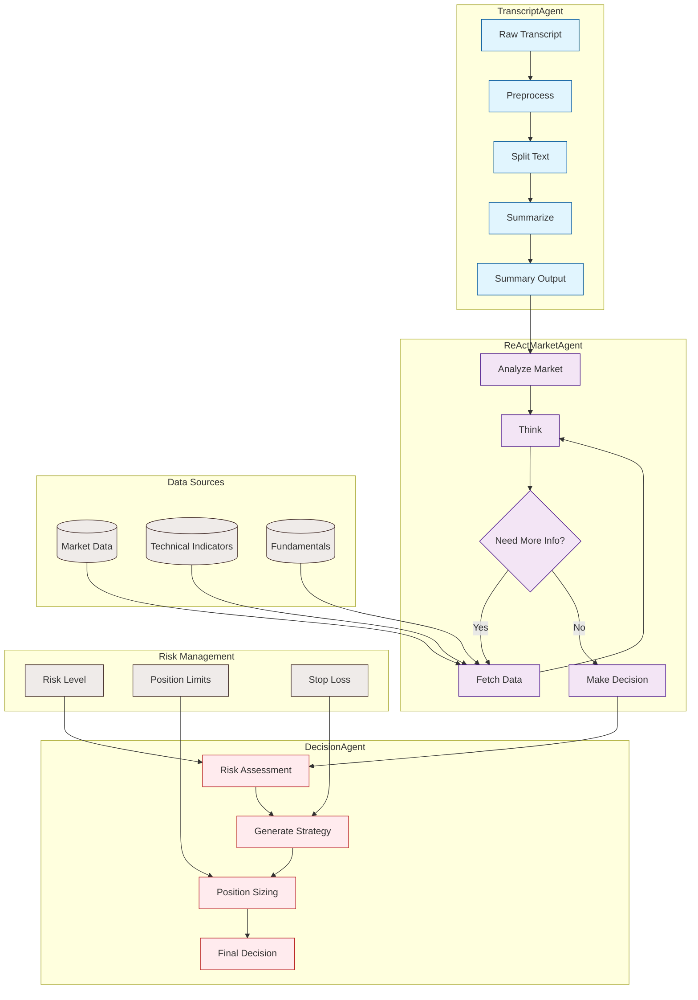

# Agents4Financial

A comprehensive financial analysis system that leverages AI agents to process daily financial video transcripts and generate investment insights.

## Project Overview

This project implements an advanced AI-driven financial analysis system that:
- Processes YouTube financial video transcripts
- Analyzes market sentiment and trends
- Generates actionable investment decisions with risk management
- Integrates multiple data sources for comprehensive market analysis

## System Architecture

### Workflow Diagram

### 1. Transcript Processing (transcript_node.py)
- Processes raw transcripts from financial videos
- Performs intelligent text segmentation and summarization
- Extracts key market insights and sentiment indicators
- Utilizes LangChain and Ollama for natural language processing

### 2. Market Analysis (market_node.py)
- Implements ReAct (Reasoning + Action) architecture for market analysis
- Processes market data through a multi-stage pipeline:
  - Analysis → Thinking → Decision
- Integrates with external data sources (yfinance, technical indicators)
- Provides dynamic market sentiment assessment

### 3. Decision Making (decision_node.py)
- Generates investment decisions based on analyzed data
- Implements comprehensive risk management
- Produces detailed investment reports with:
  - Technical analysis
  - Fundamental metrics
  - Risk assessments
  - Position sizing recommendations

### 4. Integrated Analysis (integrated_analyzer.py)
- Combines all components into a unified analysis pipeline
- Provides historical data analysis capabilities
- Generates comprehensive market reports
- Implements sentiment tracking and trend analysis

## Key Features

- 🤖 AI-Powered Analysis: Utilizes advanced LLM models for market analysis
- 📈 Technical Analysis: Integrates multiple technical indicators
- 📊 Fundamental Analysis: Processes company fundamentals and macro indicators
- 🎯 Risk Management: Built-in risk assessment and position sizing
- 📝 Detailed Reporting: Generates comprehensive investment reports
- 🔄 Historical Analysis: Supports historical data processing and backtesting

## Prerequisites

- Python 3.10+
- Required packages (install via pip):
  - langchain
  - langchain-ollama
  - opencc
  - pandas
  - yfinance
  - ta-lib
  - numpy

## Setup

1. Clone the repository:
\`\`\`bash
git clone https://github.com/yourusername/Agents4Financial.git
cd Agents4Financial
\`\`\`

2. Install dependencies:
\`\`\`bash
pip install -r requirements.txt
\`\`\`

3. Configure the Ollama model in constant.py:
\`\`\`python
model_name = "gemma3:27b"  # or your preferred model
\`\`\`

## Usage

### Basic Usage
\`\`\`python
from Agentic_AI.integrated_analyzer import IntegratedMarketAnalyzer

# Initialize analyzer
analyzer = IntegratedMarketAnalyzer()

# Analyze a transcript
result = analyzer.analyze_transcript(transcript_text)

# Generate report
report = analyzer.generate_report(result)
print(report)
\`\`\`

### Historical Analysis
\`\`\`python
# Analyze historical data up to a specific date
historical_result = analyzer.analyze_with_history("2024/04/14")
\`\`\`

## Data Structure

The system uses a modular architecture with several key components:

- **TranscriptAgent**: Processes and summarizes financial transcripts
- **ReActMarketAgent**: Analyzes market conditions using ReAct architecture
- **DecisionAgent**: Generates investment decisions with risk management
- **IntegratedMarketAnalyzer**: Combines all components for comprehensive analysis

## Output Format

The system generates structured analysis results including:

- Market sentiment analysis
- Trading signals and recommendations
- Risk assessments
- Position sizing recommendations
- Technical and fundamental indicators
- Historical trend analysis

## Contributing

1. Fork the repository
2. Create your feature branch
3. Commit your changes
4. Push to the branch
5. Create a new Pull Request

## License

This project is licensed under the MIT License - see the LICENSE file for details.
